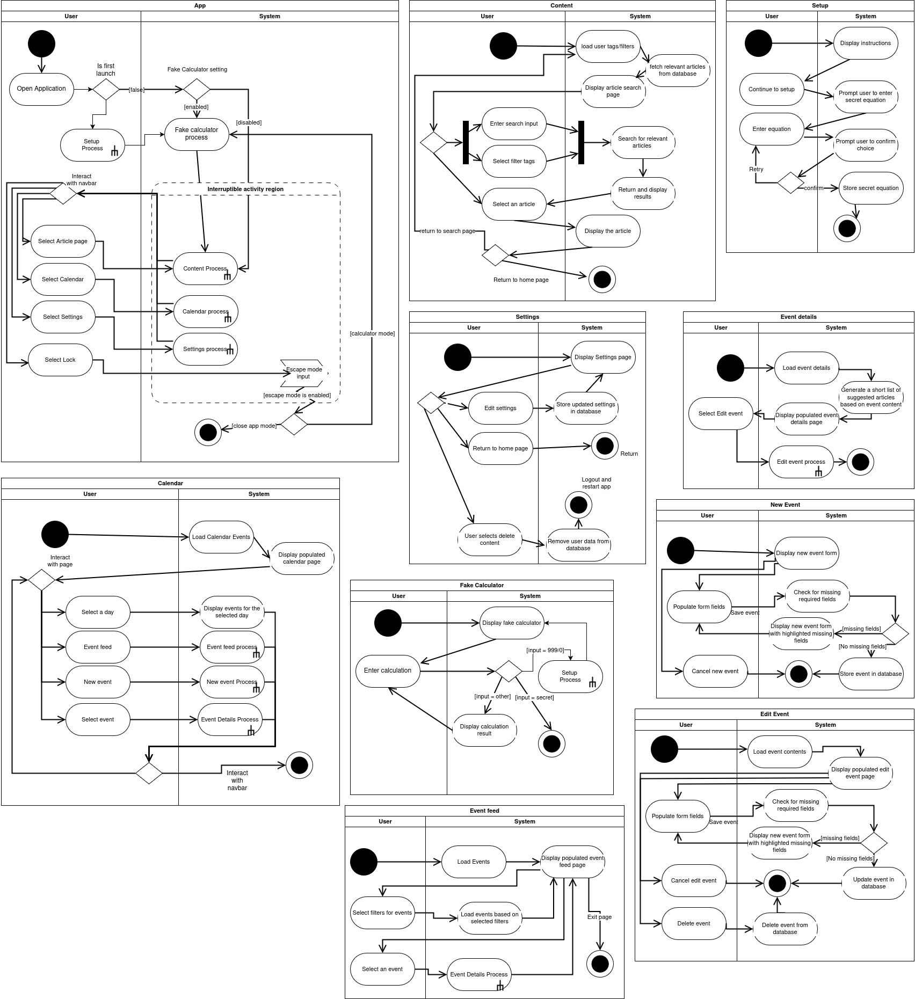
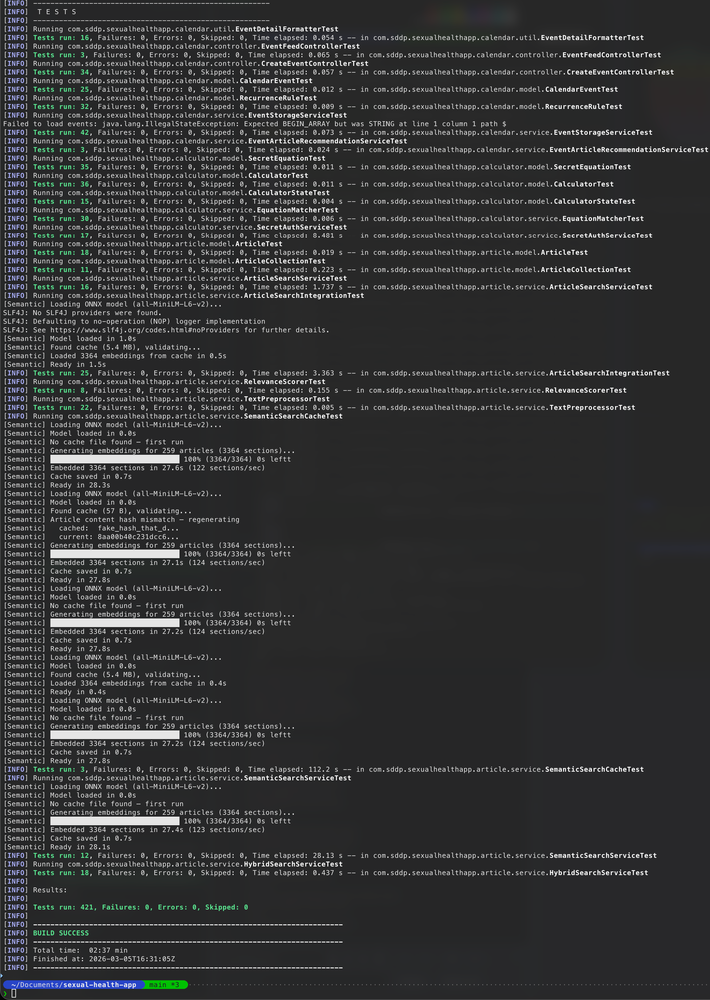
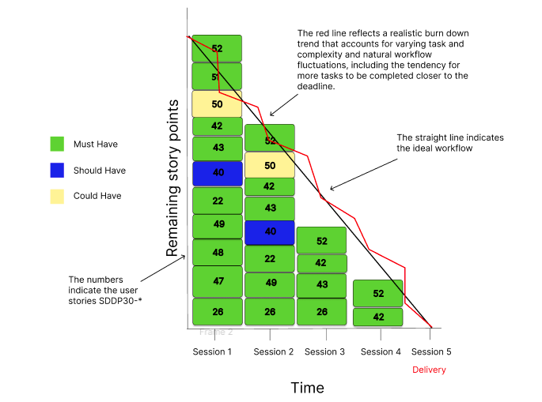
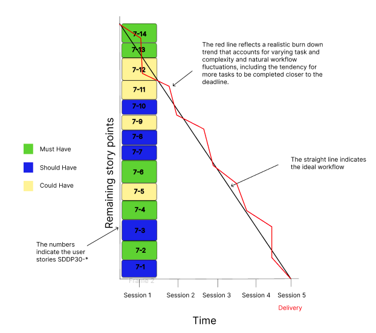

# COMP2300

**SDDP Group 30**
**D6: Increment II**

Date: 2026-03-11
Version: 1.0

| | |
|---:|:---|
| **Group Members:** | |
| Josh Wilcox | jw14g24@soton.ac.uk |
| Safiy Hussain | sh6n24@soton.ac.uk |
| Taran McVay | tm2n24@soton.ac.uk |
| Oliver Punter | op2g24@soton.ac.uk |

---

# Acceptance Criteria

In this deliverable, we use a Gherkin-style acceptance criteria format because it makes each requirement explicit, testable, and unambiguous: **Given** defines the starting state/context, **When** defines the user action or system trigger, and **Then** defines the observable outcome that must be true for the story to pass. We applied this structure across our key D6 stories (47, 22, 48, 49, and 43) using unique criterion IDs (e.g., 47-01, 22-03) so each behaviour can be traced directly to evidence and tests. This approach also lets us capture both normal flows and edge conditions (such as empty fields, recurring-event end rules, all-day events, and deleted reminders) in a consistent pass/fail form, which improves coverage, supports regression checking, and ensures the implementation is validated against user-facing behaviour rather than vague technical assumptions.

## Story 47 - Calendar View

> As a user with a busy schedule, I want a view that allows me to easily see, in calendar format, all upcoming appointments, and reminders.

| **ID** | **Given** | **When** | **Then** |
|:---|:---|:---|:---|
| 47-01 | A month is displayed on the calendar grid | The grid renders | Only valid day numbers for that month appear, and cells outside the current months are visually empty |
| 47-02 | Today's date falls within the displayed month | The calendar renders | Today's cell must be visually distinguished from the other days |
| 47-03 | One or more events exist on a given date | That day cell renders | One distinguishable coloured dot per unique event type is displayed in the cell |
| 47-04 | A day cell has events of the same type on the same date | That day cell renders | Only one dot for that event type is shown |
| 47-05 | A day has no events | That day cell renders | No dots should appear underneath |
| 47-06 | The user taps a day cell | The selection is made | The cell is highlighted, and the day's events are listed in the panel below the grid |
| 47-07 | The user taps on the previous/next month or "today" button | The navigation is triggered | The grid re-renders for the correct calendar month |
| 47-08 | The user opens the month/year picker | They select a month and year in the picker | The grid re-renders for the correct calendar month |
| 47-09 | An event has a `RecurrenceRule` | The calendar renders a relevant month | Indicator dots appear on every date that matches the recurrence pattern |
| 47-10 | A recurring event has an `UNTIL` end date | The calendar renders the month containing that end date | No dot appears for this event after the end date |


## Story 22 - Adding Events

As a user managing my sexual health, I want to add upcoming tests or check-ups with a due date and notes so that I can track my screening schedule separately from my daily medication.

| **ID** | **Given** | **When** | **Then** |
|:---|:---|:---|:---|
| 22-01 | The Create Event form is displayed | The user submits the form without an event name or date | The event is not able to be saved, and the user is prompted to fill all fields |
| 22-02 | The Create Event form is displayed | The user submits the form with a valid name, a date, and type | The event is saved and a new CalendarEvent and is persisted to events.json |
| 22-03 | An event is successfully saved | The user returns to the calendar view | The calendar automatically refreshes and the new event is visible. |
| 22-04 | The user enters a description value | The event is saved | The description is persisted and retrievable on the event detail page |
| 22-05 | The user submits the form with all optional fields left blank | The event is saved | The event is created successfully and those events are null |
| 22-06 | The user selects an event type (Appointment, Medication, or Test) from the form | The form is submitted with a valid name and date | The saved event is stored with the correct EventType and is visually distinguishable from other types in the calendar and event feed |
| 22-07 | The user enables a recurrence rule (e.g. daily, weekly) on a new event | The form is submitted | The event is saved once but appears on every matching date in the calendar, with no duplicate entries stored in events.json |
| 22-08 | The user creates a recurring event with an end date | The end date is reached and passed | The event no longer appears in the calendar or event feed beyond that end date |
| 22-09 | The user creates a recurring event with a fixed number of occurrences | The final occurrence date passes | No further instances of the event appear in the calendar or event feed |
| 22-10 | The user taps the back button on the Create Event screen without saving | The calendar view is restored | No new event has been added and the calendar state is unchanged |


## Story 48 - Upcoming Events List

As a busy user, I want a menu that simply shows upcoming events and reminders in chronological order so I can easily plan around my upcoming events at a glance.

| **ID** | **Given** | **When** | **Then** |
|:---|:---|:---|:---|
| 48-01 | The user navigates to the Event Feed view | The feed loads | All upcoming events across all types (Appointment, Medication, Test) are displayed in a single scrollable list in ascending chronological order |
| 48-02 | The event feed contains multiple events on different dates | The feed renders | Events are ordered earliest-first, with no events appearing before earlier ones |
| 48-03 | Two events share the same date but have different times | The feed renders | The event with the earlier time appears above the event with the later time |
| 48-04 | An event has no time set (an all-day event) | The feed renders on that date | The all-day event appears after any timed events on the same date |
| 48-05 | A recurring event (e.g. a daily medication) exists in storage | The feed loads | Each upcoming occurrence within the display window appears as a distinct entry, not just the original saved date |
| 48-06 | The event feed is loaded and there are no upcoming events | The feed renders | An appropriate empty-state message is shown rather than a blank or broken screen |
| 48-07 | An event occurred yesterday | The feed loads today | That event does not appear in the feed |
| 48-08 | An event is scheduled for today | The feed loads | That event is included in the feed (today counts as upcoming) |
| 48-09 | The user taps an event entry in the feed | The navigation triggers | The detailed event page for that specific event is displayed |
| 48-10 | The user taps the back button on the Event Feed | The navigation triggers | The Calendar view is restored and no data is lost or reset |


### Story 49 - The event page

| **ID** | **Given** | **When** | **Then** |
|:---|:---|:---|:---|
| 49-01 | The user taps an event in the calendar day view or the event feed | The navigation triggers | The detailed event page for that specific event is displayed, showing at minimum the event name, date, type, and time |
| 49-02 | The detailed event page is displayed for a Medication event with a dosage value | The page renders | The dosage is visible on the page |
| 49-03 | The detailed event page is displayed for a Medication event with no dosage set | The page renders | The dosage section is hidden or shows a placeholder and does not display the text "null" or crash |
| 49-04 | The detailed event page is displayed for an Appointment or Test event | The page renders | No dosage field is shown, as dosage is only relevant to Medication type events |
| 49-05 | The detailed event page is displayed for an event with a description | The page renders | The full description text is visible on the page |
| 49-06 | The detailed event page is displayed for an event with no description set | The page renders | The description section is hidden or shows a placeholder and does not display the text "null" or crash |
| 49-07 | The detailed event page is displayed for a recurring event | The page renders | The recurrence pattern is shown in human-readable terms (e.g. "Daily", "Every Tuesday and Thursday", "Monthly") |
| 49-08 | The detailed event page is displayed for a one-off event with no recurrence rule | The page renders | No recurrence section is shown on the page |
| 49-09 | The user taps the back button on the detailed event page | The navigation triggers | The user is returned to the view they came from (either the calendar or the event feed) and no data is lost or reset |


## Story 43 - Event Reminders

As a user, when I have an upcoming appointment, I want to receive a reminder so that I do not forget about it.

| **ID** | **Given** | **When** | **Then** |
|:---|:---|:---|:---|
| 43-01 | A user has saved an event with a date and time | That date and time is reached | The user receives a reminder notification within the app |
| 43-02 | A reminder notification is triggered | The user views it | The notification text uses discreet, non-specific language and does not display explicit sexual health terminology |
| 43-03 | The calculator disguise is enabled on the device | A reminder fires | The notification appears as a calculator-style prompt rather than a recognisable health reminder, so the app's purpose is not revealed |
| 43-04 | The calculator disguise is not enabled | A reminder fires | The full reminder message is shown without disguising |
| 43-05 | A recurring event is saved (e.g. a daily medication) | Each occurrence date and time is reached | A separate reminder fires for each occurrence, not just the first |
| 43-06 | An event is deleted before its reminder fires | The time at which the reminder would have triggered is reached | No reminder is delivered to the user |
| 43-07 | A recurring event has a fixed end condition (end date or occurrence count) | The final occurrence has passed | No further reminders are scheduled or delivered |
| 43-08 | The app is closed and reopened before a reminder is due | The app re-initialises | Pending reminders for future events are re-registered and not lost across sessions |
| 43-09 | A reminder fires while the app is in the foreground | The user taps the notification | The user is navigated to the relevant event's detail page |
| 43-10 | An event is saved with a time that has already passed | The reminder system processes the event | No reminder is fired, and no error or crash occurs |

Reminder criteria can't be fully evidenced with screenshots. For example, conditions defined by non-occurrence (for example, no reminder after event deletion, no reminder after recurrence end, or no reminder for past-time events) are validated through deterministic automated tests and reminder-service assertions/log output instead.

---

## Updated UML Class Diagram


## UML Activity Diagram



---

# Definition of Done

We had an informal definition of done which we used throughout our D5, however we have formalised it in this deliverable:

- All major features are developed in a separate branch.
- Features are never directly merged into our main branch. Instead they go through a Gitlab Merge Request.
- Merge Requests are not merged until approval from at least one other team member.
- All unit-testable code must have unit tests written for them.
- All tests must pass.
- Regression testing has been done to ensure no older features have been broken by this new change.
- CI/CD must pass for a branch before it can be merged in.
  - We have CI/CD that runs unit tests when we push to the repository on Gitlab..
- Our client (our supervisor) approves of the changes made.
- All code is integrated.
- There are no outstanding issues or bugs.

---

# Scenario Testing

## How we will test using our scenarios

We will use **scenario-based acceptance testing** to validate that the application works end to end from the user's perspective. Each scenario is mapped to user stories and broken into:

- **Acceptance tests** (does the scenario goal succeed?)
- **Unit tests** (small components: formatter, storage, recurrence rules, search scoring)
- **Regression tests** (ensuring previously working flows still pass after changes)
- **Boundary/partition tests** (edge cases like missing fields, null time, empty dosage, recurring events)

We run these tests on every merge request (CI). Where UI tests require JavaFx, we either:

- run them headlessly, or
- disable only the UI dependent tests on CI, keeping logic tests running everywhere.

## Scenario 2.1 (Updated) - Managing tests and Event Editing

### Updated scenario

People: Jamie Kendrick (29) - non-binary, queer/pansexual, nurse.
Setting: Jamie's bedroom at home, Sunday Evening.
Action (goal): Jamie wants to discreetly review and organise upcoming sexual health events, including PrEP reminders and a follow-up test.

Jamie is preparing for a busy work week and wants to ensure their sexual health related information are organised in one place. As discretion is important, Jamie opens the app which initially appears as a calculator. They enter their secret equation, and the app transitions to the Main Page, which functions as an article search screen.

Using the bottom navigation bar, Jamie taps the calendar icon to access the Event Feed and Calendar. The event feed displays a chronological list of upcoming appointments, medication reminders (including PrEP) and tests. Jamie notices a **follow up test** missing. From the monthly calendar view, Jamie taps **+ New Event** to open the **Create Event screen**. Jamie enters:

- name ("Clinic follow up test")
- due date
- optional description/note (non medical language)
- type = Test

After saving, the new test appears immediately in the event feed in the correct chronological position. Jamie switches to the monthly calendar view then selects a future date, and confirms the feed updates accordingly.

Jamie saves and the event appears immediately in the feed in the correct chronological order. Jamie taps the event to open the **Event Detail screen**. From the detail screen Jamie can tap **Edit**, update the note and save. The feed reflect the updated values. Jamie returns and uses the **escape/lock** feature to instantly return to the calculator.

### What we will test

**A1. Discreet entry + navigation**

- Given app is opened, it shows calculator view only
- When secret equation is entered, the app transitions to Main Page.
- When Calendar tab is selected, calendar root becomes visible and article overlay is closed.

**A2. Add test event**

- When Jamie saves a new Test event with name and date
- Then it appears immediately in the feed and monthly indicators (dots) update.
- The feed ordering remains chronological (partition: earlier/later dates)

**A3. Date selection updates list**

- Given monthly view is shown
- When Jamie selects a future date,
- Then the day event list updates to that date (partition: date with events / no events).

**A4. Event detail + edit**

- Given an event exists in the feed,
- When Jamie taps it, Event Detail opens showing name/type/date/time/description correctly.
- When Jamie taps Edit and saves changes,
- Then the updated details are shown in Event Detail and in the feed after returning.

**A5. Escape/lock privacy**

- From anywhere inside the Main App,
- When Jamie activates the lock/escape,
- Then it returns to the calculator immediately.

### Unit/regression tests that support scenario 2.1

- `EventStorageServiceTest:` add event, delete event, persist/reload, ordering, get events, create event with/without reminder
- `CalendarEventTest + RecurrenceRuleTest:` occurs on correctness for recurring events.
- `EventDetailFormatterTest:` formatting name/description/date-time, dosage visibility rules.
- `EventDetailControllerTest:` content or missing state, dosage/recurrence visibility, edit/back callbacks.

## Scenario 2.2 (Updated) - Medication event and Recovery

### Updated scenario

People: Mary Hargate (68) - retired, little confidence with technology
Setting: Mary's room in her care home, morning.
Action (goal): Mary wants to add medication with the correct dosage and reminder times without confusion.

Mary has been prescribed a new medication and wants to help remembering when to take it. She opens the app, but forgets the secret equation she previously set. Mary enters the predefined recovery equation (990/0), which opens the configuration screen, allowing her to safely reset her equation before continuing to the main page. From the bottom navigation bar, she selects the calendar icon to open the Calendar. She opens Calendar, goes to **+ New Event**, enters:

- medication name
- dosage
- reminder times (partition 1 vs 2 times, boundary: invalid time blocked)
- appears in feed/calendar

After saving, it appears in the Event Feed and calendar view in correct order. Mary exits. Mary feels happy and reassured everything is clearly organised and exists the app

### What we will test

**B1. Recovery equation path**

- Given Mary is on calculator and forgot secret equation,
- When she enters 999/0
- Then reset flow is shown and new secret equation can be set
- After setting, entering the new equation takes her to the Main App.

**B2. Medication fields + validation**

- Missing required fields are caught (boundary:blank name. null date/type).
- Medication dosage is stored and displays for medication events.
- Non medication types never show dosage (partition test)

**B3. Ordering + accuracy**

- Multiple reminders appear sorted chronologically.
- Reminder times are formatted consistently

### Unit/regression tests that support scenario 2.2

- `CreateEventControllerTest:` medication dosage + recurrence + persistence + validation partitions.
- `EventDetailFormatterTest:` dosage shown only for medication + formatting.
- `EventStorageServiceTest:` multiple events retrieved and sorted by time.

## Scenario 2.3 (Updated) - Packaged articles and structured reading experience

### Updated scenario

Josephine (Jo) Wilkinson (14) - anxious, privacy focused, curious
Setting: On a bus after school, sitting next to other students.
Action (Goal): Jo wants to discreetly access trustworthy sexual health information in a structured, non overwhelming format.

Jo opens the app, which appears as a standard calculator (discreet branding). She enters her secret equation and is taken directly to the Article Search screen. She types "burning when I pee" into the search bar. The search results display relevant articles, each showing tags associated with them. The results are ordered by relevance, which helps Jo quickly identify useful content. She opens an article. Instead of one large block of intimidating text, the article is:

- Divided into clear sections
- Displayed as swipeable chunks
- Includes a mini navigation menu at the top
- User accessible, non medical language

Jo uses the mini navigation menu to jump directly to the "Symptoms" section. Because all the articles are packaged with the application, the content loads instantly, even though she has unstable signal on the bus. When someone sits next to her, she taps the escape gesture and the calculator interface instantly reappears

### What we will test

**C1. Offline articles**

- App can load and render articles without internet connection
- Search still works on packaged content (at minimum TF-IDF should still work)

**C2. Search relevance + tags**

- Jo Searching "burning when i pee" returns relevant articles.
- Results:
  - Are ordered by relevance
  - Display associated tags
  - Are case insensitive
  - Handle punctuation

**C3. Article UI structure**

- Opening an article shows Jo chunked pages (not one huge block)
- Jo can Jump to "Symptoms" via mini navigation loads the correct section
- When Jo clicks back it returns to search results and the overlay state resets when switching tabs.

**C4. Escape**

- When Jo "escape's" it returns to calculator quickly from article view.

### Unit/regression tests that support scenario 2.3

- `ArticleCollectionTest, ArticleTest`: markdown parsing into sections, title, etc.
- `RelevanceScorerTest`: relevance ordering
- `TextPreprocessorTest`: Verifies that search queries are normalised, tokenised, and correctly extracted from article fields for reliable matching
- `ArticleSearchIntegrationTest`: Confirms that real packaged markdown articles load correctly and return relevant, correctly ordered search results
- `SemanticSearchServiceTest`: Ensures semantic search matches synonyms and everyday language queries to appropriate articles
- `HybridSearchServiceTest`: Validates that combined TF-IDF and semantic scoring produces properly ranked results
- `SemanticSearchCacheTest`: checks that semantic embeddings are cached, reloaded and regenerated correctly when article content changes.

Scenarios **2.4** and **2.5** were not used for testing as it contains features we have not yet implemented yet (**Settings**: Planned for next sprint)

## Regression testing plan

For every change, we rerun:

- `mvn test` locally before pushing
- CI pipeline tests on merge requests

We specifically rerun tests that cover:

- Create/Edit event flow
- Event storage persistence
- Event detail rendering
- Calendar feed ordering
- Article search + article view navigation

This prevents regressions like:

- adding edits breaks create
- event detail not updating after save
- event feed differs from monthly calendar view feed

## Boundary and partition testing examples we will include

**Boundary**

- Empty title / whitespace title
- Null date
- Null time (all day)
- Date in the past
- Dosage blank
- Recurrence: end date before start date
- Zero reminder times vs multiple reminder times
- Event: JSON file corrupted or empty
- Empty/null search queries
- Whitespace only search query
- Very long search query
- Search with special characters
- Unrelated search term
- Limit of recommended articles
- Empty article sections
- Articles missing markdown tags
- Null description field in event
- Recovery equation boundary case (999/0)
- Calculator: maximum input length reached
- Calculator: division by 0
- Calendar: leap years and irregular length months

**Partition**

- Event types: Appointment vs Medication vs Test
- Dates: day with events vs no events
- Medication with dosage vs without dosage
- Recurring vs non recurring events
- Recurrence: none vs daily/weekly/monthly
- Recurrence types: monthly on day/nth weekday/last day
- Recurrence: end condition until/after occurrences/ never
- Recurrence: with excluded dates/ without
- Event with/without reminder
- Search: exact term vs synonym
- Search: lowercase vs uppercase vs mixed case
- Search: single word vs multiple words
- Search: with "stopwords" vs without
- Article with multiple sections vs single section
- Article navigation: swipe vs mini navigation jump
- First time user (no secret equation set) vs returning user
- Cache present vs cache missing vs corrupted
- Secret equation incorrect vs correct input
- App state transitions

---

# Unit Testing

## Test Directory Structure

```
sexualhealthapp
├── article
│   ├── model
│   │   ├── ArticleCollectionTest.java
│   │   └── ArticleTest.java
│   └── service
│       ├── ArticleSearchIntegrationTest.java
│       ├── ArticleSearchServiceTest.java
│       ├── HybridSearchServiceTest.java
│       ├── RelevanceScorerTest.java
│       ├── SemanticSearchCacheTest.java
│       ├── SemanticSearchServiceTest.java
│       └── TextPreprocessorTest.java
├── calculator
│   ├── model
│   │   ├── CalculatorStateTest.java
│   │   ├── CalculatorTest.java
│   │   └── SecretEquationTest.java
│   └── service
│       ├── CalculationEngineTest.java
│       ├── EquationMatcherTest.java
│       └── SecretAuthServiceTest.java
└── calendar
    ├── controller
    │   ├── CreateEventControllerTest.java
    │   ├── EventDetailControllerTest.java
    │   └── EventFeedControllerTest.java
    ├── model
    │   ├── CalendarEventTest.java
    │   └── RecurrenceRuleTest.java
    ├── service
    │   ├── EventArticleRecommendationServiceTest.java
    │   └── EventStorageServiceTest.java
    └── util
        └── EventDetailFormatterTest.java
```



---

# Sprint two Review

## Stories

In this sprint, implemented the calendar, event feed, medication tracking, and reminder features, built on the article and calculator foundation delivered in Sprint 1. We also included story 26 from the previous increment, as the article navigation menu was a small, independent piece of work that can be completed in parallel with the event system without adding risk. Additionally, we allocated explicit integration tasks (story 52) to ensure that the independently developed subsystems are combined, tested end-to-end, and function correctly as a unified application.

Note that the user story ID column refers to the ID of the Jira ticket for each story. The **D** column references **Dependencies** between tasks. Tasks have been assigned such that everyone has a roughly even workload, and related tasks are handled by the same person. All features will go through a pull request and review process, so everyone is on the same page with code and code is reviewed.

Cell colours indicate MoSCoW prioritization: 🟢 Must Have · 🔵 Should Have · 🟡 Could Have

| User Story ID | Task ID | Task Description | D | Story Points | Hours Spent | Task Owner |
|:---|:---|:---|:---|:---|:---|:---|
| 26 | 26.1 | 🟢 Replace article dot page indicators with labelled navigation menu that displays each section heading | | 5 | 2.5 | Taran |
| | 26.2 | 🟢 Tapping menu items navigates to the corresponding section page and the active menu item visually updates to reflect the current section as the user navigates between sections | 26.1 | 3 | 0.5 | Taran |
| 47 | 47.1 | 🟢 Event data model and storage service to support appointments and reminders in a calendar format | | 5 | 3 | Josh |
| | 47.2 | 🟢 Calendar-style grid view with month navigation so users can see all upcoming appointments and reminders at a glance | 47.1 | 5 | 1 | Josh |
| | 47.3 | 🔵 Days that have events are visually indicated so they stand out clearly from days with no events | 47.2 | 3 | 0.5 | Josh |
| 48 | 48.1 | 🟢 Event feed service that retrieves both appointments and medication reminders and sorts them in chronological order | 47.1 | 3 | 1.5 | Taran |
| | 48.2 | 🟢 Scrollable upcoming events list view so users can quickly overview their upcoming events and reminders | 48.1 | 3 | 1.5 | Taran |
| | 48.3 | 🔵 Each event entry clearly displays its date, time, and type so users can distinguish between appointments and medication reminders | 48.2 | 2 | 0.5 | Taran |
| 49 | 49.1 | 🟢 Detailed event page layout that displays all important saved details about an event, including description and, for medication, dosage amounts | | 2 | 2 | Safiy |
| | 49.2 | 🟢 Enable navigation to the event details page when an event is clicked from the day view or the upcoming events feed | 49.1, 48.2 | 3 | 1 | Safiy |
| | 49.3 | 🟢 Enable editing and deletion of existing events | 49.1, 22.1 | - | 4 | Safiy |
| 22 | 22.1 | 🟢 Form allowing users to add upcoming tests or check-ups with a due date and notes, so they can track their screening schedule | | 3 | 2 | Oli |
| | 22.2 | 🟢 Persistence for appointment events so saved check-ups and tests are retained between sessions | 22.1 | 3 | 0.5 | Oli |
| | 22.3 | 🟢 Integrate saved appointments into the upcoming events feed, displayed separately from daily medication reminders | 22.2, 48.1 | 2 | 0.5 | Oli |
| 43 | 43.1 | 🟢 System that schedules and sends reminders to users for upcoming medication doses and check-up appointments | 40.1 | 3 | 2 | Oli |
| | 43.2 | 🟢 Implementing the display of notifications to the user | 43.1 | 2 | 1 | Oli |
| 42 | 42.1 | 🟢 Reminder notifications are discreet and use non-specific language, so users do not feel ashamed when receiving them | 43.1 | 1 | 0.5 | Oli |
| 50 | 50.1 | 🟡 Service that matches articles to events based on relevance, so users are shown related content while viewing an event | | 3 | 2 | Josh |
| | 50.2 | 🟡 Display suggested articles on the event details page in a way that is noticeable but does not distract from the event details themselves | 50.1, 49.1 | 3 | 0.5 | Josh |
| | 50.3 | 🟡 If there are no relevant articles for an event, ensure nothing is displayed rather than showing an empty or irrelevant section | 50.2 | 2 | 0.5 | Josh |
| 51 | 51.1 | 🟢 Restructure the main app layout to include a persistent bottom navigation bar with tab items for each section (e.g. Articles, Calendar) | | 3 | 1 | Safiy |
| | 51.2 | 🟢 Implement tab switching so tapping a navigation item displays the corresponding content view while keeping the navigation bar visible across all sections | 51.1 | 3 | 1.5 | Safiy |
| | 51.3 | 🟡 Style the navigation bar with active and inactive states that match the existing app design language, clearly indicating which section the user is currently viewing | 51.2 | 2 | 0.5 | Safiy |
| 52 | 52.1 | 🟢 Integrate the calendar view, event feed, and medication reminder subsystems so that events created in one component are correctly reflected across all views | 47.2, 48.2, 40.2 | 3 | 2 | Taran and Josh |
| | 52.2 | 🟢 End-to-end integration testing across the full event pipeline, verifying that creating, persisting, displaying, and receiving reminders for events works correctly as a unified flow | 52.1 | 3 | 1.5 | Whole Team |
| | 52.3 | 🔵 Integrate the bottom navigation bar with all feature screens and verify consistent navigation behaviour, ensuring state is preserved when switching between tabs | 51.2, 52.1 | 2 | 2.5 | Josh/Safiy |

## Completed Burndown Chart



The **burndown chart** illustrates the team's progress throughout Sprint 2 by showing the renaming story points over time. The **straight diagonal line** represents the ideal rate of progress, where work would be completed evenly across the sprint. The **red line** shows the actual progress made by the team.

At the beginning of the sprint, progress was slightly slower than the ideal trend, as the team was still implementing foundational functionality and resolving integration between components. As development continued, the rate of completed tasks increased, causing a steeper decline in the remaining story points. This reflects the natural workflow of the sprint, where several tasks were completed closer to the later sessions once core features were implemented and tested.

Overall, the chart shows that the team successfully completed the planned work by the final session, reaching zero remaining story points at delivery. The variation between the ideal and actual lines demonstrates a realistic development process where work was not completed uniformly but was instead influenced by task complexity and dependencies between features.

---

# Sprint 3 Plan

Our sprint 3 plan deviates slightly to what we originally planned. As some of the planned stories became redundant or irrelevant based on what we have already implemented. This is expected in an AGILE environment, so through meetings we came up with what increment will provide the best value, while also doing the expected refinements and polish that would be in a final increment.

Cell colours indicate MoSCoW prioritization: 🟢 Must Have · 🔵 Should Have · 🟡 Could Have

| User Story ID | Task ID | Task Description | D | Story Points | Assigned Person | Backup Person |
|:---|:---|:---|:---|:---|:---|:---|
| D7-1 | D7-1.1 | 🔵 Add a setting to enable or disable calculator-disguise launch mode and persist the preference locally | | 3 | Oli | Josh |
| | D7-1.2 | 🔵 Update startup routing so disabling disguise opens the main app directly, while preserving manual lock/disguise access | D7-1.1 | 2 | Oli | Josh |
| D7-2 | D7-2.1 | 🟡 Add reminder-visibility settings that let users choose discreet vs non-discreet reminder wording | | 3 | Oli | Safiy |
| | D7-2.2 | 🟡 Apply the selected reminder wording mode to reminder notification text generation | D7-2.1 | 3 | Oli | Safiy |
| | D7-2.3 | 🟡 Ensure existing reminder settings default safely and update correctly when users change reminder-visibility mode | D7-2.2 | 2 | Oli | Safiy |
| D7-3 | D7-3.1 | 🔵 Persist recently read article state (article ID, last read section/chunk, timestamp) | | 4 | Josh | Taran |
| | D7-3.2 | 🔵 Add a "Recently Read" area in the article feed ordered by recency | D7-3.1 | 4 | Josh | Taran |
| | D7-3.3 | 🔵 Reopen recently read articles at the saved progress position | D7-3.1 | 3 | Josh | Taran |
| D7-4 | D7-4.1 | 🟢 Add dark mode and high-contrast display options so users can choose a clearer visual style | | 3 | Safiy | Taran |
| | D7-4.2 | 🟢 Add simple settings so users can switch between standard, dark, and high-contrast views | D7-4.1 | 3 | Safiy | Taran |
| | D7-4.3 | 🟢 Ensure the chosen display style is used consistently across the main app screens | D7-4.2 | 2 | Safiy | Taran |
| D7-5 | D7-5.1 | 🟡 Refactor `styles.css` into multiple feature-oriented CSS files and update loading/import wiring | | 3 | Taran | Safiy |
| | D7-5.2 | 🟡 Remove duplicated selectors and verify no regressions from CSS split | D7-5.1 | 2 | Taran | Safiy |
| D7-6 | D7-6.1 | 🟢 Implement a global text-size scaling setting with bounded size levels | | 5 | Safiy | Josh |
| | D7-6.2 | 🟢 Apply increased text-size scaling to article, calendar/event, and settings UIs without layout breakage | D7-6.1 | 5 | Safiy | Josh |
| | D7-6.3 | 🟢 Persist text-size preference and provide reset/default behavior | D7-6.1, D7-6.2 | 3 | Safiy | Josh |
| D7-7 | D7-7.1 | 🔵 Add OpenDyslexic font asset and a settings toggle for enabling it | | 2 | Safiy | Taran |
| | D7-7.2 | 🔵 Apply OpenDyslexic font consistently to readable content surfaces | D7-7.1, D7-6.1 | 1 | Safiy | Taran |
| D7-8 | D7-8.1 | 🔵 Add shape-based event indicators in calendar views so event types are distinguishable without color alone | | 2 | Safiy | Josh |
| | D7-8.2 | 🔵 Keep indicator semantics consistent between calendar cells and event/feed representations | D7-8.1 | 1 | Safiy | Josh |
| D7-9 | D7-9.1 | 🟡 Add "suggested articles" cards within article views (article-to-article recommendations) | | 2 | Josh | Safiy |
| | D7-9.2 | 🟡 Hide the suggestion area when no relevant articles are available | D7-9.1 | 1 | Josh | Safiy |
| D7-10 | D7-10.1 | 🔵 Add onboarding prompt directing users to settings, with short explanatory video content | | 2 | Josh | Oli |
| | D7-10.2 | 🔵 Ensure onboarding prompt flow is shown at the right step and can be revisited from settings/help path | D7-10.1 | 1 | Josh | Oli |
| D7-11 | D7-11.1 | 🟡 Add blocked tags / filters section in settings for user content preferences | | 3 | Josh | Taran |
| | D7-11.2 | 🟡 Weight search ranking based on user tags/identity settings while respecting blocked tags | D7-11.1 | 3 | Josh | Taran |
| | D7-11.3 | 🟡 Highlight relevant matched tags in a distinct result color treatment | D7-11.2 | 2 | Josh | Taran |
| D7-12 | D7-12.1 | 🟡 Implement parental control mode setup with lock/passcode management | D7-11.1 | 4 | Taran | Josh |
| | D7-12.2 | 🟡 Enforce blocked-tag/content gating in search and article browsing when parental mode is active | D7-12.1, D7-11.2 | 4 | Taran | Josh |
| | D7-12.3 | 🟡 Provide controlled unlock flow requiring parental passcode to access restricted content | D7-12.2 | 3 | Taran | Josh |
| | D7-12.4 | 🟡 Ensure restricted content remains hidden across related recommendation/filter surfaces while parental mode is active | D7-12.1 | 2 | Taran | Josh |
| D7-13 | D7-13.1 | 🟢 Add privacy policy page in settings explaining data/storage/notification usage | | 2 | Oli | Josh |
| | D7-13.2 | 🟢 Add clear privacy policy entry point from onboarding/settings navigation | D7-13.1, D7-10.1 | 1 | Oli | Josh |
| D7-14 | D7-14.1 | 🟢 Integrate the accessibility, personalisation, and parental-control features so settings from one area are respected consistently across search, article, and calendar flows | all | 3 | Safiy | Josh |
| | D7-14.2 | 🟢 End-to-end integration testing across the Sprint 3 feature pipeline, verifying settings persistence, content filtering, reminder visibility options, and recently-read behaviour in one unified flow | all | 3 | Taran | Josh |
| | D7-14.3 | 🔵 Integrate onboarding/settings guidance with the new feature set and verify users can discover and return to key controls without breaking navigation state | all | 2 | Josh | Oli |

## Burndown Chart



The burndown chart illustrates the planned progress of Sprint 3 by showing the remaining story points across the sprint sessions. The straight diagonal line represents the ideal rate of task competition, assuming work is completed consistently throughout the sprint. The red line reflects a more realistic expectation of progress, accounting for variations in task complexity and the likelihood that some work will be completed later in the sprint as features become integrated and refined.

The chart also categorises user stories using the **MoSCoW** prioritisation method, where green represents **Must Have** features, blue represents **Should Have** features, and yellow represents **Could Have** features. This ensures that essential functionality is prioritised and completed first. The user story identifiers are displayed within the blocks to show which tasks contribute to the remaining story points.

Overall, the burn down chart provides a visual plan for how the team expects to complete the Sprint 3 workload across the development sessions, ensuring that the most critical features are delivered by the final delivery milestone.

---

# Group Report

## Summary of Work Completed

In Deliverable 6, the project continued the **deliver** phase of the **Double Diamond Model**, focusing in implementing the second major functional subsystem of the application. While the previous increment focused on article access and the calculator disguise mechanism, this increment introduced the event management functionality which organised appointments, medication reminders and sexual health tests within a unified calendar system.

This increment builds directly on the application foundation implemented in D5. The calculator disguise and article search system now function as the entry point to a wider set of features accessible through a persistent bottom navigation bar. Through this navigation system, users can switch between article browsing, calendar views (event feed), settings and also contains a lock tab when clicked returns to the calculator disguise.

The primary functionality implemented during this increment includes the calendar view, event feed, event detail page, event editing, event creation forms, reminders and mini navigation inside articles. Users can now add appointments, medication reminders and tests, which are stored and displayed chronologically within the event feed and visually represented in the calendar view. Events can also be opened to reveal a dedicated event details page which displays additional information such as notes, dosage information for medication reminders, an edit button to edit details about the event and other contextual details.

The application continues to follow a **Model-View-Controller (MVC)** architecture which separates data models, services and user interface controllers. This architecture allows individual subsystems such as the event system, article system and calculator authentication mechanism to remain loosely coupled while still functioning as part of a unified application.

Overall, this increment successfully delivered the second part of the system, enabling users to organise and manage their sexual health and related events in discreet and structured manner.

## Report on Specific Tasks that Make up D6

### Implementation

During this increment, the development focused on implementing the calendar, event, article navigation and reminders subsystems described in the sprint plan. These features extend the functionality of the application beyond information access and allow users to actively manage aspects of their sexual health routine.

The event subsystem was implemented using a combination of data models, controller logic and user interface views. Core event types were defined for appointments, medication reminders and tests, allowing the system to represent different categories of events while sharing a common underlying structure.

A calendar interface was developed to visually display upcoming events in a monthly grid format. Days containing events are highlighted based on even type so that users can quickly identify important dates and event types. In addition to this, a chronological event feed was implemented which lists upcoming events in order of occurrence. This feed combines appointments, reminders and tests into a single view so that users can easily understand their upcoming schedule.

A detailed event page was also introduced. This screen allows users to view full information associated with an event and provides options to edit or modify event data. For medication reminders, this includes dosage information and reminder times, while appointments and tests can include descriptive notes.

Event creation forms were implemented to allow users to add new events directly from the application interface. These forms collect the required information such as event title, date, time and optional notes.

Navigation inside articles was also implemented allowing users to jump to sections in the article without needing to scroll. Suggested articles on the page were also introduced to allow users to navigate to articles similar to the one they were reading improving user experience.

The persistent bottom navigation bar implemented was further integrated to support navigation between article system and the newly implemented event system. A new lock tab was also introduced taking users to the calculator disguise once pressed. This ensures consistent navigation behaviour across all application screens.

### Testing

Testing remained a central component of this increment to ensure the correctness and reliability of the new event functionality.

**Unit tests** were implemented to verify the behaviour of key components within the event subsystem, including event models, event storage services and controller logic. These tests validate operations such as event creation, event persistence, chronological sorting of events and the correct display of event details.

**Boundary and partition testing** were applied to ensure the system behaves correctly under different input conditions. Examples include verifying behaviour when event titles are empty, when dates or times are missing, and when optional fields such as dosage information are absent.

**Scenario based testing** was also performed to verify that the application behaves correctly when used in realistic user situations. These scenarios simulate how personas interact with the application to manage appointments, medication reminders and access sexual health information while maintaining discretion.

**Regression testing** was conducted throughout the sprint to ensure that previously implemented functionality, including article search and calculator authentication, continued to operate correctly after the introduction of the event subsystem.

**Automated tests** were executed using Maven and JUnit, and **continuos integration pipelines** were used to automatically run the test suite whenever changes were pushed to the repository. This ensured that integration issues were detected early and prevented unstable code from being merged into the main branch.

## Planning and Management

Project management for this increment continued to follow an **Agile Scrum** based workflow. Development work was organised into Sprint 2, which focused on implementing article navigation, the calendar, event feed and reminder related user stories.

**Jira** was used to manage the sprint backlog and track the progress of individual tasks. User stories were broken down into smaller implementation tasks, allowing work to be distributed evenly among the team members. Each task was assigned a primary owner and a backup contributor where appropriate to reduce the risk of delays.

A **burndown chart** was used to monitor sprint progress and provide transparency regarding the remaining workload. This allowed the team to adapt to changes and reallocate work where necessary.

Version control was managed using **Git** with a feature branch workflow. Each feature was developed on its own branch before being merged into the main branch through a merge request. Code reviews were conducted as part of the merge request process to ensure code quality and consistency across the project.

**Continuos integration pipelines** automatically built the project and executed the test suite for each commit. This ensured that integration error were detected early and that the codebase remained stable throughout the sprint.

Overall, the use of **Agile** principles, version control workflows and automated testing tools helped the team coordinate development effectively and deliver the planned features within the sprint timeframe.

## Tools and Techniques Used

The application architecture follows the **Model-View-Controller (MVC)** design pattern. This architectural approach separates the application into models that represent data structures, views that represent user interface components and controllers that manage user interactions. This separation improves maintainability and allows different components of the system to be developed and tested independently.

**Automated** testing was implemented using **JUnit** within the **Maven** build system. **Unit tests** verify individual components in isolation while integration tests validate interactions between subsystems. **Boundary** and **Partition testing** techniques were used to evaluate system behaviour across a range of input conditions.

**Continuos integration** was implemented through **GitLab pipelines**, which automatically compile the application and run the test suite whenever code changes are pushed to the repository. This approach helps ensure that integration issues are detected early and that the main branch remains stable.

Project planning and progress tracking were managed using **Jira**, which provided a central platform for managing user stories, sprint tasks and backlog prioritisation.

Version control was handled using **Git** with a feature branch workflow. Merge requests were used to perform peer reviews and ensure that code changes were discussed and validated before being integrated into main codebase.

## Reflection on the Process

### What Went Well

A major success in this phase was that our team focused much more on **testing and gathering evidence** from the start. Rather than treating testing as a final checklist at the very end, we used it to help us figure out how to build and connect features as we went along.

In practice, this worked well because we:

- Wrote clear definitions of what "success" looks like for each feature before building them, and made sure our tests specifically checked for those exact outcomes.
- Thought about extreme scenarios and edge cases early on (for example, asking "what happens if a user leaves a required field blank, or enters unusual times for reminders?").
- Automatically re-tested our older, working features every time we added new code. This ensured our new work didn't accidentally break anything that was already functioning.

This approach improved two key areas: **verification** (are we building the app correctly without bugs?) and **validation** (are we building what the users actually need?). It also made reviewing each other's code much easier, because a task was only considered "done" when it visibly worked as intended, not just when the code was written.

Another strength was sticking to our planned structure. By keeping our code organized and clearly assigning tasks in our project tracker, different team members could work on different parts of the calendar (like the event feed, details, and reminders) at the same time without getting in each other's way.

### What Could Be Improved

Our main weakness was **managing tasks that rely on each other**. Some work couldn't be started because team members were waiting on other tasks to finish. This meant a lot of the final combining and polishing work was rushed at the very end of our work cycle. It created unnecessary pressure and forced us to fix things hastily, rather than combining our work smoothly over time.

We also noticed that we were much better at guessing how long it would take to build individual pieces of the app than we were at guessing how long it would take to connect them together and test them. As a result, a lot of the actual task completion happened right at the deadline.

To improve in the next phase, we should:

- Set strict deadlines for tasks that block other work, and agree on exactly when to ask for help if a task gets stuck.
- Create an earlier deadline specifically for finishing our testing documentation, so our written proof of testing actually matches the final code we wrote.
- Do a quick, basic run-through of the app on different devices before we finalize the code to catch platform-specific bugs earlier.
